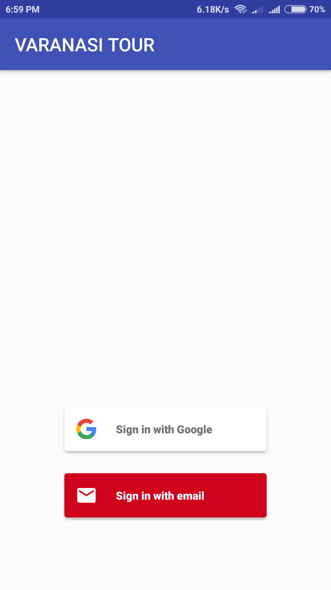

**Product Definition**

The proposed product is an android application for the tourist to help them in traveling Varanasi. It uses the google map to show the places and in these application there are four option i.e. Historical Place, Top Attraction, Restaurants and Sites and in each option there are different places to visit. If you click on any places do you like to visit it will direct you to the google map and show the exact place.

**User Interface**

The interface will meet the following requirements to conform to the user’s needs: It will be simply and easy to understand .Controls which allow the user to interact with the application will be clear and imply their functionality within the application .The app contains 4 list of relevant attractions and each list item contains information about an historical place, restaurants, Top attraction and Sites. And there is an image with each place. Images of the application interface shown below

**5.2 Software for Development Machine**

Operating System: Windows 7/8/10 Other Tools :Android Studio for Android programming

**5.3 Hardware for Development Machine:**

Memory:4GB or more Other Requirements: Android Smartphone with version 5.0 or above for Testing Internet Connection

**5.4 Software for Client**

Operating System: Android Version 5.0 or above

**5.5 Hardware for Client:**

Memory: 1 GB or more Other Requirement: Internet Connection Android Device with version 5.0 or above operating system Internet connection

**5.6 Functional Requirements**

1.	The app should display the list of relevant attractions.
2.	When a list is clicked on, it should take the user to the contents of the respective list.
3.	The list should display the names and location of a place in a well-defined order
4.	Those lists containing images of the location should display the images at appropriate positions relative to the locations.
5.	When the place is clicked it should get the user to the google map showing the exact location.
6.	When the up arrow on the title bar is pressed, it should take the user back to the main page.

**5.7 Non-functional requirement**

**5.7.1 Usability**

Tour guide application is easy to use by using clear words and menus.
**5.7.2 Portability**

This software will be designed to run on any Android operating system version 5.0 or higher. The software will be forward compatible for all currently released Android operating system versions.
**5.7.3 Maintainability**

The application can be maintained easily
**5.7.4 Availability**

The application will be available at all times on the user’s Android device , as long as the device is in proper working order. The functionality of the application will depend on any external services such as internet access that are required. If those service are unavailable, the application does not work.
**5.7.5 Security**

The software is fully secured and should never collect personal information from its own users.
**5.7.6 Reliability**

The application will meet the functional requirement without any unexpected behavior. At no time it will display incorrect information.

**Main Functionality**

 Animation on the Splah Screen 
 
 SignIn Through firebase Authentication and Firebase UI
 
 
 4 relevent list of the tourist place and in each list there is a list of places and when you can see the details of that place and to see the direction to that place you can click on the location button and to book ola cab you can click on the taxi button 
 

**SCREENSHOT**

